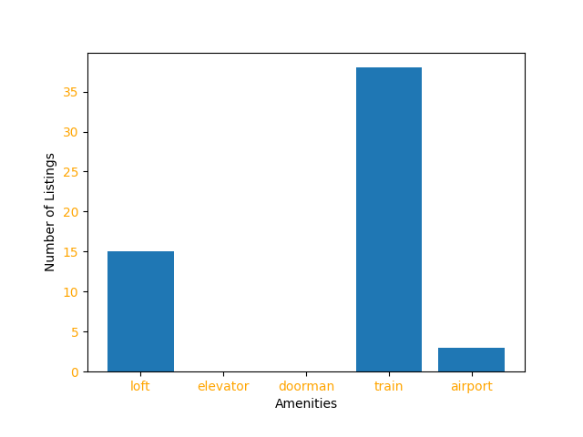

### Zip Code: 11385 

#### To conduct this analysis, the Airbnb dataset of New York City listings from 2019 was used. 

*Home to more than 106,717 people, Ridgewood, Queens is a neighborhood that consists of a mostly white and Hispanic population. Located by the Queens and Brooklyn boundary, Ridgewood borders the neighborhoods of Maspeth, Middle Village and Glendale, as well as the Brooklyn neighborhoods of Bushwick and East Williamsburg. Considering the fact that we’re looking at an AirBNB data set, I thought it’d be important to understand the types of housing units for categorical data. 86.39 percent of the buildings are multi-unit structures while 13.47 percent are single unit structures. Also, there are 38,325 housing units 8.35 percent of which are vacant.*

### Understanding Ridgewood:

#### Commute:
Commuters from Ridgewood can easily access the L and M subway lines. The L subway line, which runs along 14th Street in Manhattan and has connections to other major lines, stops on Ridgewood’s border with Bushwick at Myrtle-Wyckoff Avenues and at Halsey Street. The M train, with service to Midtown, has stops in Ridgewood including Myrtle-Wyckoff Avenues, Seneca Avenue,Forest Avenue, Fresh Pond Road and Middle Village-Metropolitan Avenue.
#### Safety:
Ridgewood does not fare so well in terms of crime and safety as assault and robbery per 100,000 residents ranges far higher than the national average. However, in terms of property crimes, the numbers reported range more than fifty percent below the national average.
#### Diversity:
In terms of racial diversity, Ridgewood consists of primarily Hispanic and White residents with a smaller percentage of Asian and African American individuals.

### Ridgewood Statistics:
- There is a total of 423 listings in Ridgewood.
- The highest priced Airbnb listing in Ridgewood is $375.
- The lowest priced Airbnb listing is $20.
- The median price for listings in Ridgewood is $60.
- The mode for minimum number of nights in Ridgewood is 1.
- The most common “room_type” for listings in Ridgewood is “Private room”. 
- 21 listings in Ridgewood are available all year round.

#### Figure 1: This graph shows the prices for Airbnb listings across Ridgewood. As you can see, the highest listing is $375 and the lowest listing is $20. The range for the prices is $355 and that shows us that listings in Ridgewood provide options for customers with a wide range of budgets.

#### Figure 2: The following graph plots the availability for listings in Ridgewood. You can see that 21 listings are available all year round and many listings come close to be available 365 days out of the year. This shows which listings are available for long term stays and can aid someone is parsing out the listings that fit their criteria.

#### Figure 3: The following scatter plot shows the Airbnb listings’ locations in relation to one another. This provides an idea of how close each listing is.

#### Figure 4: The following pie chart visualizes the different types of rooms for listings in Ridgewood, Queens. Private rooms make up 67.1% of the listings. 30.5% of the listings are for an entire home/apartment. 2.4% of the listings are a shared room. This chart is an informative visualization and shows us that private rooms make up most of the Airbnb listings in Ridgewood. This is ideal for customers who are looking for a private stay where they don’t have to interact with other people when they stay at a listing.

#### Figure 5: The following bar graph to show how many listings in Ridgewood, Queens have specific amenities such as a loft, an elevator, a doorman, nearby trains, and an airport. Zero Airbnb listings in Ridgewood have an elevator or a doorman. 15 listings are lofts. 3 listings are near airports. 38 listings have nearby trains. This visual is very important when trying to understand the listings in Ridgewood because it shows how desirable the listings may be. Out of 423 total listings in Ridgewood only 38 have nearby trains.

### Airbnb listings in Ridgewood Specified by Room Type:
<iframe src="AirbnbLocations.html" width="600" height="400" frameborder="0" frameborder="0" marginwidth="0" marginheight="0" allowfullscreen></iframe>
### Summary:
Ridgewood is desirable in terms of its range of prices and affordability. It is also desirable in terms of availability and the number of non-shared listings. However, it does not do well in terms of amenities. Very few listings are near trains. None have doormen or elevators and very few are near an airport.
